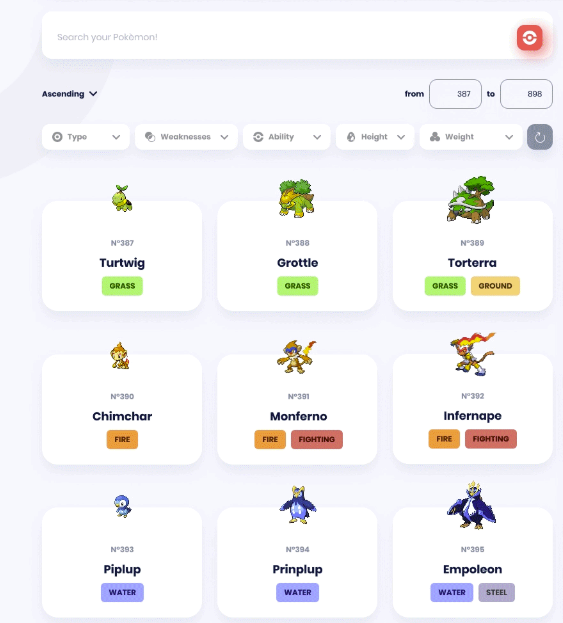
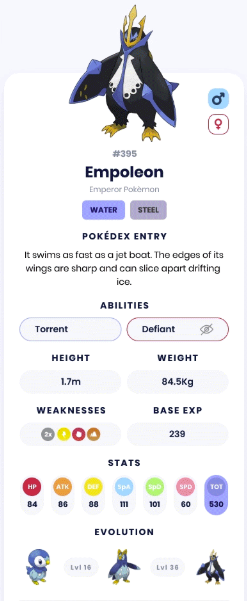

# 📘 Pokédex Homework (React + Vite + TanStack Query + shadcn/ui)

Build a small **Pokédex Explorer**. Start with a searchable grid of Pokémon (name, image, types, Pokédex number).
On click, navigate to a **details view** showing entry text, genders, types, abilities, height, weight, weaknesses, base XP, stats, and evolutions.

> You can use **React Router** or a **simple state-based page switcher** — either is fine.

---

## 🖼️ Mockups (reference only)

Grid view:


Details view:


---

## 🧰 Tech Stack

- **Vite** (React) — fast setup
- **TanStack Query** — data fetching + caching
- **shadcn/ui** — (Recommended)
- **TypeScript**
- Optional: **React Router** (or your own simple page switcher)

---

## ✅ Requirements (Phase 1)

- Pokémon **grid** with cards showing:
  - **#ID** (Pokédex number)
  - **Name**
  - **Official artwork image**
  - **Types** (e.g., GRASS, FIRE)
- **Search bar** by name with **debounce**
- **Pagination or Infinite Scroll** (your choice)
- Click a card → show a **details view** for that Pokémon
- Proper **loading** and **error** UI

### Phase 2 — Details View (full spec)

- **Name, ID, Image**
- **Pokédex Entry** (flavor text)
- **Genders** (male/female availability)
- **Types**
- **Abilities**
- **Height & Weight**
- **Weaknesses** (type damage relations)
- **Base Experience**
- **Stats** (HP, Atk, Def, SpA, SpD, Spe)

### Phase 3 — Evolution chain (bonus)

- **Evolution chain** (previous / next)
- **Switch between male/female sprites** in the details screen.

### Phase 4 — Filters (bonus)

- Filter the grid by **Type**, **Weakness**, maybe **Ability**, **Height/Weight**

---

## 🔗 PokéAPI Endpoints You’ll Use

Base: `https://pokeapi.co/api/v2`

### List & Basic Data

- **List Pokémon (paginated)**  
  `GET /pokemon?limit=20&offset=0`  
  Use `next` from the response for pagination / infinite scroll.

- **Pokémon details (by id or name)**  
  `GET /pokemon/{id|name}`  
  Gives: `id`, `name`, `types`, `abilities`, `stats`, `height`, `weight`, `base_experience`, `sprites`.

  - Official artwork path: `sprites.other["official-artwork"].front_default`

### Species (entry text, gender, evolution link)

- **Species (by id or name)**  
  `GET /pokemon-species/{id|name}`  
  Use:
  - `flavor_text_entries` → find an English entry (e.g., `language.name === "en"`)
  - `gender_rate` (−1=genderless; otherwise female chance = gender_rate/8, male chance = 1 − that)
  - `evolution_chain.url` → follow to get the chain

### Type (weaknesses)

- **Type**  
  `GET /type/{id|name}`  
  Use `damage_relations.double_damage_from` etc. to derive weaknesses/resistances.

### Evolution chain

- **Evolution chain (follow URL from species)**  
  `GET /evolution-chain/{id}`  
  Parse `chain` → `evolves_to` recursively to list the stages, and names/ids of species.

## Check https://pokeapi.co/docs/v2

## 🧠 Hints

**src/lib/api.ts**

```ts
const API = "https://pokeapi.co/api/v2";
export const endpoints = {{
  list: (limit=20, offset=0) => `${{API}}/pokemon?limit=${{limit}}&offset=${{offset}}`,
  pokemon: (idOrName: string|number) => `${{API}}/pokemon/${{idOrName}}`,
  // etc..
}};

  // Use like this:
  const res = await fetch(endpoints.list(limit, offset));
```

---

## 🧪 Done Checklist

- [ ] Grid shows #ID, name, image, types
- [ ] Search is debounced and filters results
- [ ] Pagination or infinite scroll works
- [ ] Details show entry, genders, abilities, H/W, weaknesses, base XP, stats, evolutions
- [ ] Clean loading/error states
- [ ] Code split into components + hooks
